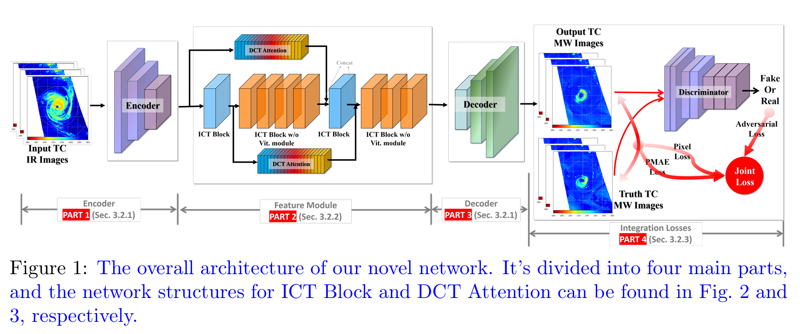

# TCIR2MW

### Overview
This repository is a PyTorch implementation of Employing Vision Transformer and Physical Guidance to Generate Microwave Images from Infrared Images of Tropical Cyclones.

### Abstract

Microwave images with high spatiotemporal resolution are essential for observing and predicting tropical cyclones (TC). Nevertheless, the temporal resolution of tropical cyclone microwave (TCMW) images is limited due to satellite quantity and orbit constraints, presenting a challenging problem for TC disaster forecasting. This research suggests using high-temporal-resolution tropical cyclone infrared (TCIR) images to generate TCMW images, offering a solution to this problem. In particular, we introduce a deep learning network based on the Vision Transformer (TCA-VIT) to convert TCIR images into TCMW images. We integrate a phase-based physical guidance mechanism into the training process. Furthermore, we have developed a dataset of TC infrared-to-microwave image conversions (TCIR2MW) for training and testing the model. Experimental findings indicate that this approach efficiently and accurately extracts crucial TC features. When TCMW images are unavailable, it utilizes IR images to supplement MW image generation, facilitating tasks such as TC intensity and precipitation forecasting. This study introduces a novel approach to the field of TC image research, with the potential to advance deep learning in this direction and provide vital insights for real-time observation and prediction of global TC. Our source code and data are publicly available online at https://github.com/kleenY/TCIR2MW

### Introduction to Catalog Files

1. The checkpoints folder is used to save trained models.
2. The utils folder contains the tool files we need to use.
   - The numpy_to_image.py file is used to convert numpy files to png image files.
3. The util folder contains the tool files we need to run our code.
4. The options folder contains the parameter settings we need to run and test, including the basic parameter settings and test parameter settings.
5. The models folder contains all of our network model files.
6. The images folder contains the images that we needed to display in README file.
7. Main Documents:

   - my_dataset_2.py and my_data.py  are used to build dataset and dataloader;
   - my_vit_test.py is used to test model effects.

### Network Structure Diagram

### Experimental results

Comparison of experimental results

### How to use

1. [Click to download our with Pre-training model model and test set data;](https://drive.google.com/drive/folders/1zWU75XcW2isYdNvAlZV0vTSCxD0Q9M__?usp=drive_link)
2. The pre-training model is in the checkpoints/inf2mw folder and the test set can be in any folder;
3. Use the my_vit_test.py file for testing, and pay attention to the path setting of the test set file;
4. The result of the run is saved in the test folder of the current file (it will be created by itself, and the result is in numpy file format);
5. Use the numpy_to_image.py file in the utils folder to convert the test results to image files.

### Citations

If TCIR2MW helps your research or work, please consider citing TCIR2MW.

Fan Menga,b, Tao Songc, Xianxuan Lina, Kunlin Yangc,d,∗

a Nanjing University of Information Science and Technology, Nanjing, 210044, China 

b State Key Laboratory of Climate System Prediction and Risk Management (CPRM), Nanjing, 210044, China 

c China University of Petroleum (East China), Qingdao, 266580, China 

d Khalifa University of Science and Technology, Abu Dhabi, 127788, United Arab Emirates

∗Corresponding author

[kleenY/TCIR2MW (github.com)](https://github.com/kleenY/TCIR2MW)

Our training code and complete data will be updated as soon as possible.

### Contact

If you have any question, please email `ikunyang14@163.com`.
